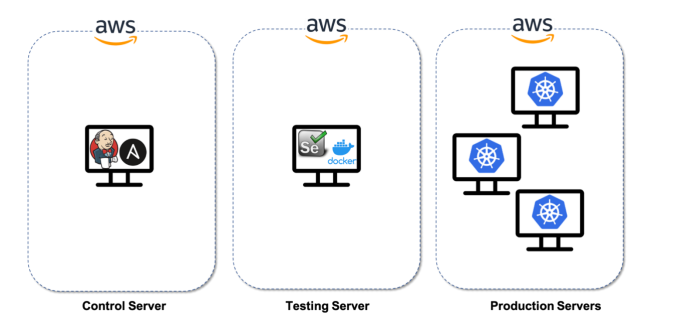

# Capstone
This project has been designed to simulate an end-to-end DevOps project implementation.

# Requirement
1. Dockerize a production application which is written in flask. Sample flask applicaion used: https://github.com/15richa/flask-sample.git. Fork this project as you would later enable webhooks for Git to send events to Jenkins.
2. Use Kubernetes to deploy this app
3. Create a Jenkins pipeline to deploy the latest version of the app the moment there is a change on the github repo
4. Create an automated test case, to verify the app is working. Only when the test case is passed, the application will be deployed on Kubernetes. For testing, application has to be deployed on Docker
5. Additionally, there are some backup servers on which Configuration Management has to be setup.
For a proof of concept, install jdk on all of them using Ansible

# Implementation
1. Provision AWS EC2 instances to host Jenkins and Kubernetes cluster. For showcasing the proof of concept, below deployment architecture is being used.



   This scripts provides Terraform script using which you can setup your cluster. Please note, it would be recommended to manually provision an AWS EC2 instance with below configuration which will be used to run the terraform and other scripts.

   a. Launch Ubuntu 20.04 t2.micro EC2 machine.
   b. Note: In the security group, open ports 22, 80, 8080, 9999 and 4243. 
   c. Use the EC2 tag "Lab-<yourname>"

2. Once you have your AWS EC2 Lab launched and in running state, SSH into the instance using the keys used while launching the Lab VM and clone this Git project.

3. Run below command on the Lab VM to setup custom hostname. Once done, exit and re-login to VM.

``` 
sudo hostnamectl set-hostname CICDLab
```

4. Once you re-login to VM, run below commands to update APT and install unzip.

```
sudo apt update
sudo apt install wget unzip -y
```

5. Install Terraform on the Lab VM using below command.

```
#Download Terraform Binaries
wget https://releases.hashicorp.com/terraform/1.2.8/terraform_1.2.8_linux_amd64.zip
unzip terraform_1.2.8_linux_amd64.zip

#Move the Terraform binary to /usr/local/bin
sudo mv terraform /usr/local/bin

#Verify terraform is installed
terraform -v

#Remove temporary package
rm terraform_1.1.5_linux_amd64.zip
```

6. Install Python and AWS CLI to Lab VM running below command.
```
sudo apt-get install python3-pip -y
sudo pip3 install awscli boto boto3 ansible
```

7. Once you have installed AWS CLI, configure following below steps. This will configure AWS account in your LAB environment which will be used by the Terraform module.

```
aws configure
Access Key ID:
xxxxxxxxxxxxxxxxx
Secret Access Key:
xxxxxxxxxxxxxxxxxxxxxxxxxxxxxxx
```

***Note: 
If you need to create new credentials, Follow below steps
Go to aws console. On top right corner, click on your name or aws profile id. 
when the menu opens, click on Security Credentials
Under AWS IAM Credntials, click on Create access key. If you already have 2 active keys, 
you can deactivate and delete the older one so that you can create a new key

Complete aws configure step

8. Verify AWS account is configured running below command. This is just for reference and other AWS CLI command can be used too.

```
aws s3 ls
```

9. Create an inventory host file which will be used by Terraform to fetch AWS EC2 instance details and write into inventory which later can be referred by Ansible playbook.

```
# Create hosts inventory file with the necessary permissions
sudo mkdir /etc/ansible && sudo touch /etc/ansible/hosts
sudo chmod 766 /etc/ansible/hosts
```

10. Now we will run the Terraform scripts to provision infrastructure. As a first step, create a key using ssh-keygen in your Lab environment.

```
ssh-keygen -t rsa -b 2048 

# This will create id_rsa and id_rsa.pub in /home/ubuntu/.ssh/
# Keep the path as /home/ubuntu/.ssh/id_rsa; don't set up any passphrase
# Basically just hit 'Enter' key for the 3 questions it asks
```

11. Navigate to terraform/variables.tf and update the keyname and sg_id below. Reference values are in the script.

12. Now execute the below terraform commands to provision the infrastructure. Below command to be executed from the "terraform" directory.

```
Now, execute the terraform config files to launch the servers

terraform init
terraform fmt
terraform validate
terraform plan
terraform apply -auto-approve
```

13. After the terraform code is executed, check hosts inventory file and ensure below output. 

```
#Sample
sudo cat /etc/ansible/hosts
#It will show ip addresses of jenkins server and docker server as below.

[jenkins-server]
X.X.X.X
[docker-server]
X.X.X.X
[k8s-controller]
X.X.X.X
[k8s-node1]
X.X.X.X
[k8s-node2]
X.X.X.X
```

14. Now SSH into each of server provisioned using Terraform and check they are accessible

```
ssh ubuntu@<Jenkins ip address>
# Set the hostname
sudo hostnamectl set-hostname Jenkins
exit
```

```
ssh ubuntu@<kubernetes ip address>  
sudo hostnamectl set-hostname Kubernetes
```

15. We will now run Ansible playbooks to deploy Jenkins and Docker server. For Kubernetes, user can either setup up the nodes based on their usage and use the sample script **scripts/install_kubernetes.sh**

For running the playbooks, navigate to **ansible/playbooks** and run below command from the Lab VM.

```
ansible-playbook configure_infra.yaml 
```

16. Once Jenkins and Docker are installed you need to configure the deployment. First verify whether servers are up and running.

To verify Jenkins installation, access below from your browser
```
#Get Jenkins IP from /etc/ansible/hosts
http://<IP address of Jenkins server>:8080/

#Get Docker IP from /etc/ansible/hosts
http://<IP address of Docker server>:4243/version
```

17. We now have the servers ready, now it need to be configured. Copy private key to Jenkins server so that we can SSH into docker server from jenkins server.

```
ansible jenkins-server -m copy -a "src=/home/ubuntu/.ssh/id_rsa dest=/home/ubuntu/.ssh/id_rsa" -b
```

Now SSH into the Jenkins server and get the initial password for Jenkins
```
ssh ubuntu@<IP address of Jenkins server>
sudo cat /var/lib/jenkins/secrets/initialAdminPassword
```

Now, go to the browser and enter Jenkins URL. When asked provide the inital password you fetched from Jenkins server.
```
http://<IP address of Jenkins server>:8080/
```

- Under Unlock Jenkins, enter the above Initial password. Continue.
- Click on Install suggested Plugins on Customize Jenkins page.
- Once the plugins are installed, it gives you the page where you can create new admin user id and password. 
- Enter user id and password. Save & Continue. 
- In next step, on Instance Configuration Page, verify your Jenkins Public IP and Port Number then click on Save and Finish.
- Go to Manage Jenkins > Manage Plugins

18. Before we create our pipeline in Jenkins, we will configure the webhook. Go to the Github project you cloned for flask-app at the begining of the setup. Click on **Settings > Webhooks** and configure the webhook by providing the Payload URL of your Jenkins server.

The Payload URL will be in the format: **http://<IP address of Jenkins server>:8080/github-webhook/**

19. Now create a new Jenkins Job **Dashboards > New item** of type pipeline. Under the Git project section provide the Git url as below,

**Project url: https://github.com/15richa/flask-sample.git**

Under Build trigger, select **Github hook trigger for GITScm polling**

Locate pipeline code at **scripts/pipeline.groovy**, update the docker account and hub token and then create your Jenkins pipeline.

